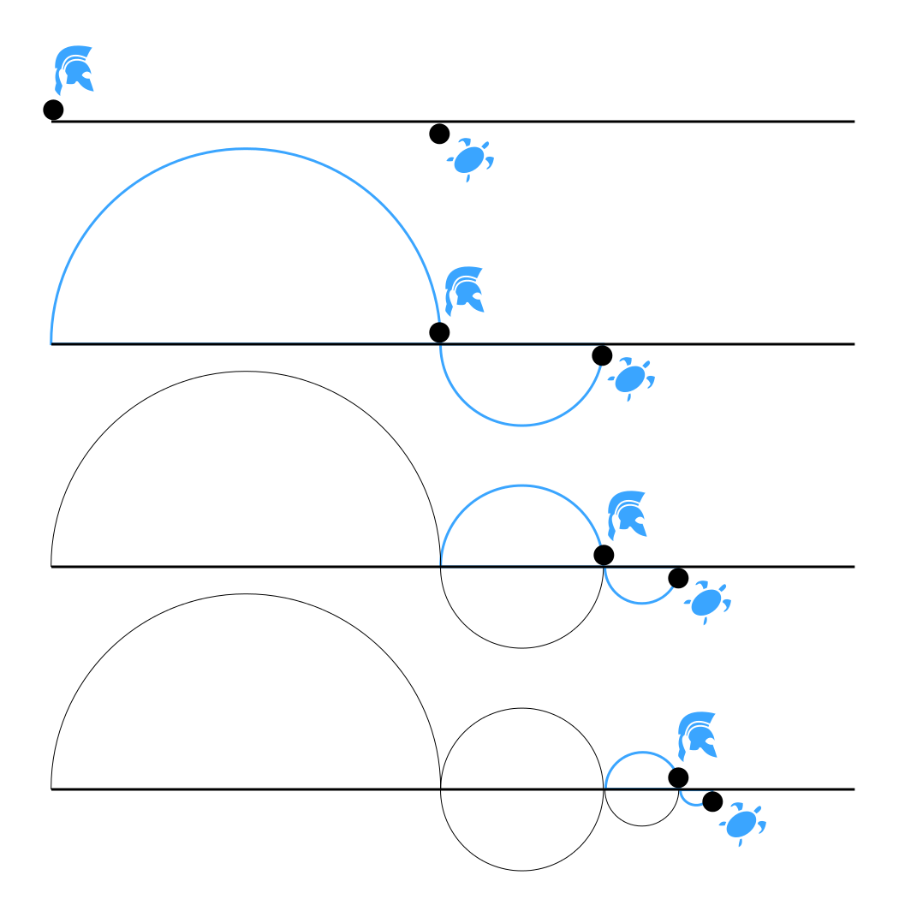

# Předsokratovské období

## Mílétská škola
* Přístav Mílétos 
* **Hledali pralátku (arche)**
  * Měla být původem všeho
  * Aktivní zdroj
* Hýlozisté
  * Hýlé — látka/hmota
  * Zoe — život

### Filosofové
1. **Thales**
  * Pralátka — voda
  * Země je deska plující na oceánu
  * Svět je plný bohů
2. **Anaximandros**
  * Pralátka — apeiron
    * Něco nepřesného, neurčeného, neohraničeného, nekonečného
    * Všechno z něj vzniká a zase do něj zaniká
3. **Anaximenes**
  * Pralátka — vzduch
    * Vzduch je součástí všeho, co žije — dýchá

* Pralátka je součástí všeho

## Pythagorejci
### Pythagoras ze Samu
* Škola *Bratrstvo*
* Exoterické x esoterické
  * Esoterika — tajné učení pro zasvěcené
* Lidé se jich báli, upálili je ve stodole
* Jako první se nazval filosofem 
* Před spaním si máme položit 3 otázky:
  1. Co jsem učinil
  2. Čím jsem se provinil
  3. Co jsem zmeškal

### Čím se zabývali
* **Morálka** — člověk potřebuje nějakého pána
  * Může to být bůh, nebo třeba aristokrat
* **Náboženství** — ofickopythagorická tradice
  * Lidská duše se za trest převtěluje, je nesmrtelná
    * Tuto myšlenku přebírá platón
    * Tělo je pro duši hrobem
* **Vědění**
  * Základ vědění je číslo (jako prostorová, geometrická veličina)
    * Má vyjadřovat poměr mezi jednotlivými částmi
    * Pokud je poměr správný, vzniká hudba sfér

## Herakleitos z Efesu
* Přezdívka *temný filosof*
  * Filosofie byla elitářská, pouze pro úzký okruh jedinců
  * Někdy si protiřečil
  * Démos (lid), doxa (mínění) — pohrdal tím
  * ==„Svět je věčně planoucím ohněm“==
  * „Nevstoupíš dvakrát do stejné řeky“
  * Dialektické myšlení

## Elejská škola
### XENOFANÉS z Kolofonu
* Kritizoval antropomorfismus
* Bůh je ve všem
  * Bůh=svět, svět=bůh
  * **Pantheismus**

### Parmenidés z Eleje
* „Bytí je, nebytí není“
  * Bytí je věčně trvající, je jediné a není žádný pohyb — všechno je vyplněno bytím
* Smysly nepodávají člověku pravdivé poznání — mohou nás klamat
* Racionalista 🧠

### Zenon z Eleje
* Aporie — důkazy o neexistenci pohybu
  * Achilles a želva 🐢

* Letící šíp neletí 🏹
* Lidé se myslí že něco vědí, ale nic nevědí

## Empedokles z Akragantu
* 4 základní praprincipy — voda, oheň, vzduch, země
  * Na ně působí 2 principy
    * Konstruktivní — umožňuje vznik — láska
    * Destruktivní — ničí — svár

## Atomisté
### Demokritos
* Svět je jednota bytí a nebytí
* Rada do života — všeho s mírou

#### Atharaxia
* = blaženost
  * Spokojenost, radost mysli člověka
* Jsou mnohem důležitější duchovní statky
